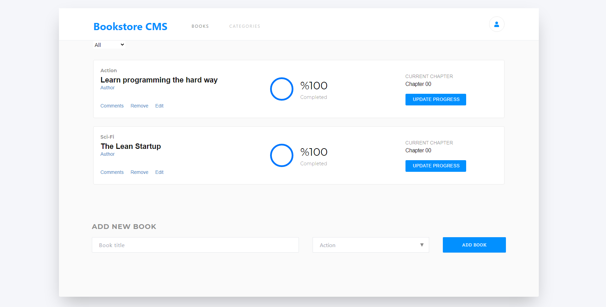

# React 

> A library built with react, and redux used for managing the state of the application.

## Built With

- React.js
- TailwindCSS

## [Bookstore CMS](https://cms-books.herokuapp.com/)

[React]()

## Getting Started

- `git clone git@github.com:AshakaE/cms-books.git`
- `cd cms-books`
- `npm install`
- `npm start`

### Prerequisites

Node.js

## Author

👤 **Ashaka Egerega**

- GitHub: [@AshakaE](https://github.com/AshakaE)
- LinkedIn: [AshakaE](https://www.linkedin.com/in/AshakaE/)

👤 Andres Ortegon

- GitHub: [@helman101](https://github.com/helman101)
- Twitter: [@helman1011](https://twitter.com/Helman1011)
- LinkedIn: [Andres Ortegon](https://www.linkedin.com/in/helman101/)

## 🤝 Contributing

Contributions, issues and, feature requests are welcome!

Feel free to check the [issues page](https://github.com/AshakaE/cms-books/issues).

## Show your support

Give a ⭐️ if you like this project!

## Acknowledgments

- To Microverse for their `README` template.

## 📝 License

Copyright 2021 Ashaka Egerega and Andres Ortegon

Permission is hereby granted, free of charge, to any person obtaining a copy of this software and associated documentation files (the "Software"), to deal in the Software without restriction, including without limitation the rights to use, copy, modify, merge, publish, distribute, sublicense, and/or sell copies of the Software, and to permit persons to whom the Software is furnished to do so, subject to the following conditions:

The above copyright notice and this permission notice shall be included in all copies or substantial portions of the Software.

THE SOFTWARE IS PROVIDED "AS IS", WITHOUT WARRANTY OF ANY KIND, EXPRESS, OR IMPLIED, INCLUDING BUT NOT LIMITED TO THE WARRANTIES OF MERCHANTABILITY, FITNESS FOR A PARTICULAR PURPOSE, AND NONINFRINGEMENT. IN NO EVENT SHALL THE AUTHORS OR COPYRIGHT HOLDERS BE LIABLE FOR ANY CLAIM, DAMAGES, OR OTHER LIABILITY, WHETHER IN AN ACTION OF CONTRACT, TORT OR OTHERWISE, ARISING FROM, OUT OF, OR IN CONNECTION WITH THE SOFTWARE OR THE USE OR OTHER DEALINGS IN THE SOFTWARE.

